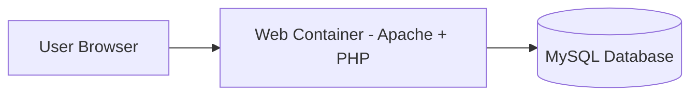
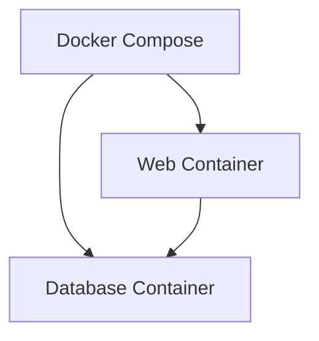
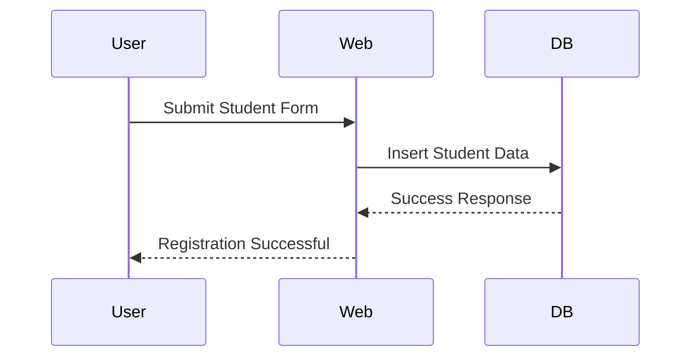
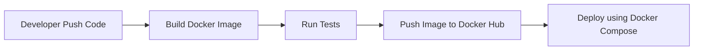

# 🎓 Student Registration Application
### Dockerized Multi-Container Web Application


---

# 📌 Project Overview

The **Student Registration Application** is a containerized web application built to demonstrate **modern DevOps and containerization practices**.

The application allows users to:

• Submit student information through a web form  
• Store submitted data in a MySQL database  
• Deploy the entire application using Docker containers  

This project demonstrates key DevOps concepts such as:

• Containerization  
• Multi-container architecture  
• Docker Compose orchestration  
• Portable deployments  
• Docker Hub image distribution  

---

# 🚀 Key Features

✔ Fully Dockerized Web Application  
✔ Multi-Container Architecture  
✔ Docker Compose Service Orchestration  
✔ MySQL Database Initialization  
✔ Simple Web Interface  
✔ Portable Deployment Across Servers  
✔ DevOps Friendly Project Structure  

---

# 🏗 System Architecture

The application follows a **two-tier architecture** where a web container communicates with a database container.

```
User Browser
      │
      ▼
Web Container
(PHP + Apache)
      │
Docker Network
      │
      ▼
Database Container
(MySQL)
```

---

# 📊 Architecture Diagram



---

# 📦 Container Architecture



---

# 🔄 Application Workflow



---

# 🛠 Technology Stack

| Technology | Purpose |
|------------|--------|
| Docker | Containerization |
| Docker Compose | Multi-container orchestration |
| Apache | Web server |
| PHP | Backend logic |
| MySQL | Database |
| HTML | Frontend interface |

---

# 📁 Project Structure

```
student-registration-app
│
├── docker-compose.yml
│
├── web_tire
│   ├── Dockerfile
│   ├── form.html
│   └── submit.php
│
├── db_tire
│   ├── Dockerfile
│   └── init.sql
│
└── README.md
```

---

# 🐳 Docker Images

The application uses two Docker images.

| Image | Description |
|------|-------------|
| student-web | Apache + PHP Web Server |
| student-db | MySQL Database Server |

These images can be pushed to **Docker Hub** and reused anywhere.

---

# ⚙️ Prerequisites

Before running this project ensure the following tools are installed:

• Docker  
• Docker Compose  
• Git  

Verify installation:

```
docker --version
docker-compose --version
```

---

# 🚀 Deployment Guide

## 1️⃣ Clone Repository

```
git clone https://github.com/yourusername/student-registration-app.git
cd student-registration-app
```

---

## 2️⃣ Build Docker Images

```
docker-compose build
```

---

## 3️⃣ Start Containers

```
docker-compose up -d
```

---

## 4️⃣ Verify Running Containers

```
docker ps
```

Expected output:

```
student-web
student-db
```

---

# 🌐 Access the Application

Open your browser and navigate to:

```
http://SERVER_PUBLIC_IP:8080
```

You will see the **Student Registration Form**.

---

# 💾 Verify Database Data

Access MySQL container:

```
docker exec -it student-db mysql -u root -p
```

Enter password:

```
root123
```

Run queries:

```
USE studentdb;
SELECT * FROM students;
```

---

# 📥 Docker Hub Deployment

Login to Docker Hub:

```
docker login
```

Tag images:

```
docker tag student_php_app-web username/student-web
docker tag student_php_app-db username/student-db
```

Push images:

```
docker push username/student-web
docker push username/student-db
```

---

# 🔄 CI/CD Pipeline Concept

This project can easily integrate with CI/CD tools such as:

• GitHub Actions  
• Jenkins  
• GitLab CI  

Example pipeline workflow:



---

# 🔐 Security Best Practices

For production deployments consider implementing:

• Environment variables for credentials  
• Docker secrets for sensitive data  
• HTTPS using reverse proxy (NGINX)  
• Container health checks  
• Persistent Docker volumes for database storage  

---

# 📈 Future Enhancements

Possible improvements for this project:

• Kubernetes deployment  
• Automated CI/CD pipeline  
• Monitoring using Prometheus & Grafana  
• Centralized logging with ELK Stack  
• Authentication system  

---

# 👨‍💻 Author

**Prasad Bhoite**

Cloud & DevOps Engineer

---

# ⭐ Support

If you find this project helpful, please consider giving the repository a **GitHub Star ⭐**.

It helps other developers discover the project.

---

# 📜 License

This project is licensed under the **MIT License**.

---

# 🙌 Acknowledgements

Thanks to the open-source communities behind:

• Docker  
• MySQL  
• Apache  
• PHP  
